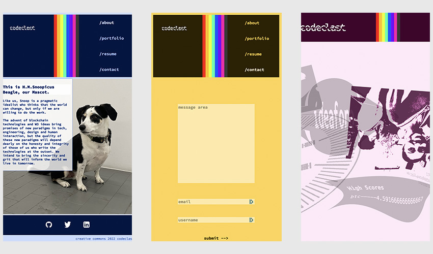

# codeclast 2.0
  

  

  ## OVERVIEW:
   A professional website that hosts a porfolio, cv, contact and about page and that showcases my abilities as a programmer. This will be a site where friends and strangers can see and get to know my work. Employers and family will both be able to see my range of skills. The most subtle elements that really won't be noticed were some of the most fun to implement.

  ## Table Of Contents:
  [Installation](README.md#installation) 
  [Usage](README.md#usage) 
  [Tests](README.md#tests) 
  [Credits](README.md#credits) 
  [Questions](README.md#questions) 
  [License](README.md#license) 

  ## Installation
  Created with React, to be installed on a heroku site where the public will be able to interact with it.

  ## Usage
  The site should be intuitive. A reminder when adding more projects, that in addition to adding them to the project array, they will need to be arranged in the css page.

  ## Tests
  verson 2.1 is expected to have tests? We're hoping. 

  ## Credits
  It takes a village to make a website, but particular shout out to Mustaq Ahamad who had a brilliant article on how to switch themes, that I leveraged very heavily here. The article is here: https://medium.com/@haxzie/dark-and-light-theme-switcher-using-css-variables-and-pure-javascript-zocada-dd0059d72fa2   ...Also to Barrett Sontag who made this brilliant tool that makes great use of css filters: https://codepen.io/sosuke/pen/Pjoqqp and the favicon converter people here https://favicon.io/favicon-converter/ and all the node dependency developers and everyone whos in my package.json - you are in my heart as well.

  ## Questions
  [Becket, Codeclast](becketbowes@gmail.com)
  [Github Page](http://www.github.com/becketbowes)

  ## License
  [Creative Commons Attribution License, Sat May 07 2022 19:26:46 GMT-0400 (Eastern Daylight Time)](https://creativecommons.org/licenses/by/4.0/legalcode)
